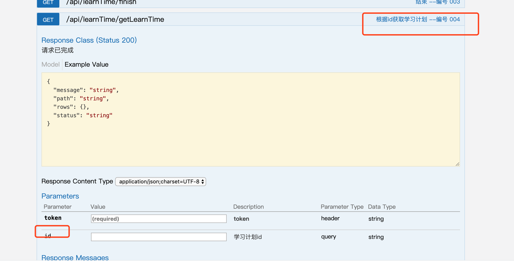
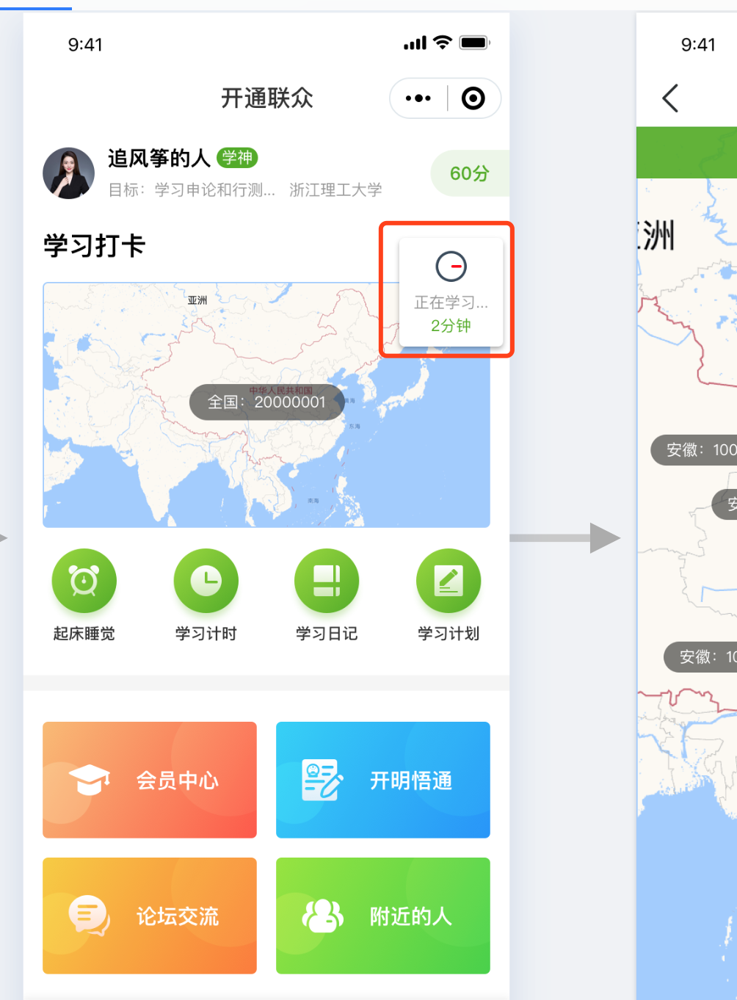
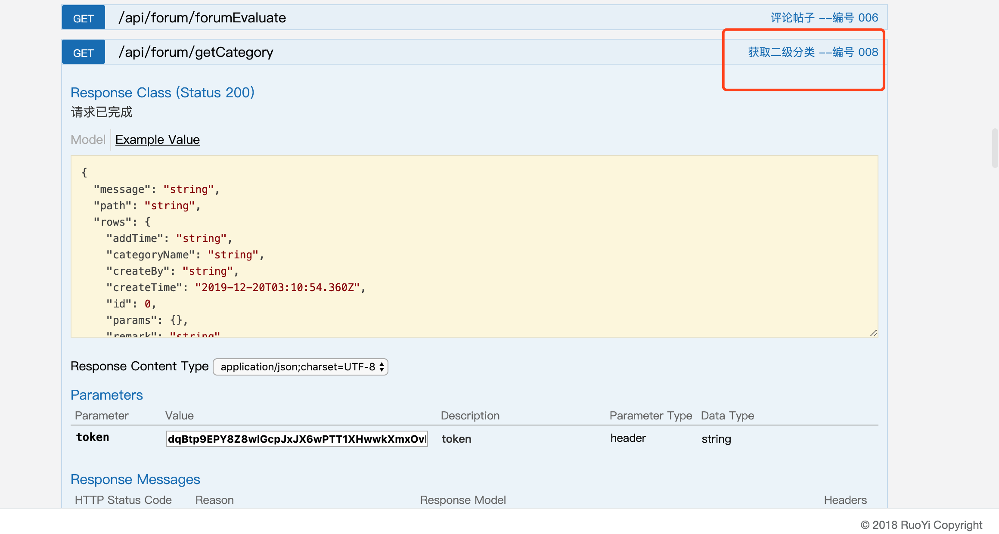
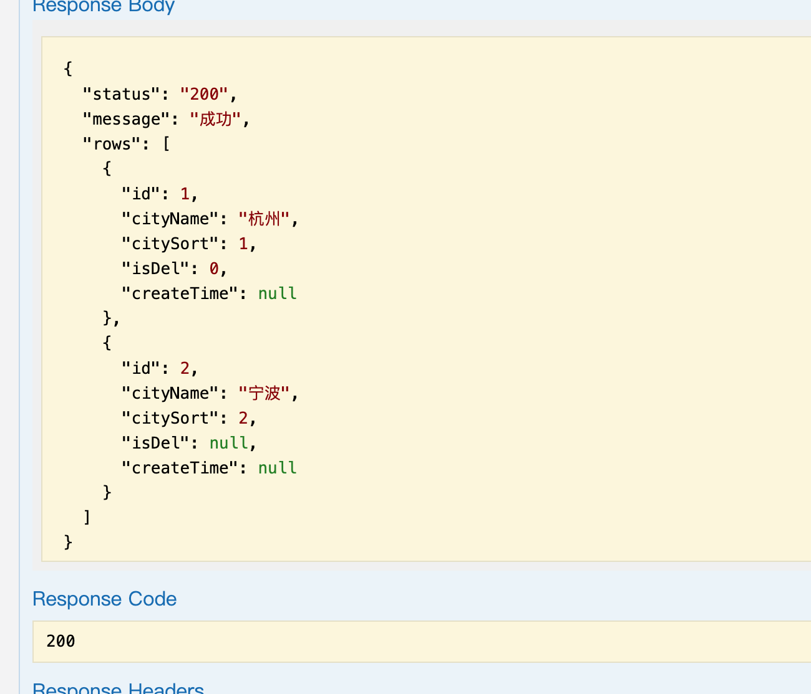
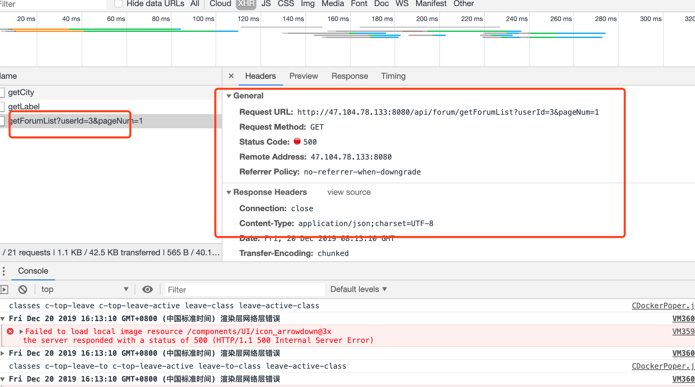
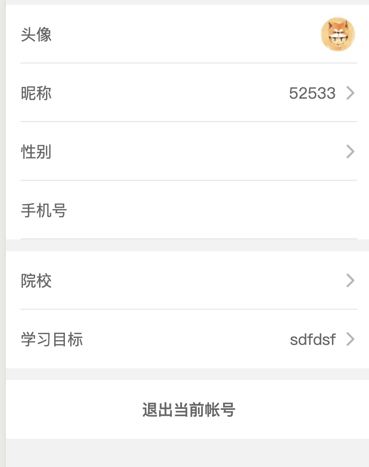

1. 接口还是没有一个 获取用户信息的接口，登入之后首页需要显示用户的一些基本信息，
建议弄一个 获取用户信息的接口，之后关于用户的信息都可以放到这接口里
2. 学习计时，需要一个获取 当前计时了多久的接口，首页有一个显示 学习了多久的ui

3.学习计时接口，只有有暂停但是没有开始的接口。

4.现在学习计划返回的列表id 都是 null

5.论坛少接口，获取一级分类和地区的接口没有，

一级分类需要知道一级分类的数据。关注什么的信息,关注分类的接口也没有的

6. 论坛的列表现在没有数据 
7.发帖的时候 获取分类的接口没有的

